# Game Flow — Minecraft Camping Escape Room

**Duration:** ~75-100 minutes
**Players:** Kids ages 7-10
**Core principle:** Kids start with nothing but a diary. Every tool is crafted before use.

---

## The Flow

### Step 0: The Beginning
Kids receive:
- **Explorer's Journal** — starts with a few pages:
  - Page 1: Story intro about the lost treasure and the old explorer
  - Page 2: *"To craft tools, you'll need a crafting table. Find 4 oak planks hidden near the campsite..."*
  - Page 3: **Recipe: Crafting Table** (4 oak planks in 2x2)

Hidden near the campsite (easy to find):
- **4 Oak Plank blocks**
- **3 Sticks** scattered around

In the tent (visible but locked chest with "💥 TNT Required" sign):
- **Treasure Chest** — chained shut, taunting them from the start

---

### Step 1: Craft the Crafting Table
Kids bring 4 oak planks to the game master.

**Recipe:** 4 Oak Planks (any 2x2 corner)

Kids craft on the ESP32 table → success animation plays.

**Unlocks:** The Explorer Tent — sign: *"🏕 Explorer Tent — Crafting Table Required"*

Inside the tent:
- **The Crafting Table** (already there — ESP32 tech piece)
- **Small Chest #1** — 4 Iron Ingots + 2 Sticks
- **Under the Pillow** — 1 Redstone + 1 Coal
- **Small Chest #2** — Journal Page: Compass Recipe
- **Locked Treasure Chest** — chained, "💥 TNT Required" sign (the finale prize)

---

### Step 2: Craft the Compass (→ door 2)
**Recipe:** 4 Iron + 1 Redstone (cross pattern)

Kids craft → receive **MCompass** (points north) + **Direction Card #1**

*"Walk 40 paces North to the Mossy Boulder, then 30 paces East to the Old Stump..."*

---

### Step 3: Follow Compass Directions
Direction cards lead them through 3-4 waypoints using cardinal directions.

Along the way: 2 extra Sticks

Final waypoint chest:
- **3 Cobblestone blocks**
- **2 Sticks**
- **2 String**
- **Journal Page: Cobblestone Pickaxe Recipe**
- **Direction Card #2:** *"The Old Mine is 50 paces South..."*

---

### Step 4: Craft the Cobblestone Pickaxe (→ door 0)
**Recipe:** 3 Cobblestone + 2 Sticks (top row + center column)

Kids craft → receive **Cobblestone Pickaxe**

Follow directions to **"The Old Mine"** — sign: *"⛏ Cobblestone Pickaxe Required"*

---

### Step 5: The Old Mine
Inside:
- **8 Paper**
- **1 String** (now they have 3 total)
- **2 Copper Ingots**
- **Journal Page: Map Recipe**
- **Direction Card #3:** *"Return to camp. The map will guide you further..."*

---

### Step 6: Craft the Map (no door — iPad activates)
**Recipe:** 8 Paper + 1 Compass (center)

Kids craft → **iPad fog-of-war map lights up!**

**Admin trigger:** Reveal mine, villager, sand locations, and key POIs on the map.

*Note: The compass block is "consumed" into the map.*

---

### Step 7: Trade with the Villager
Map shows villager location. Villager says:
- *"I'll trade my knowledge for something shiny from the quarry... but you'll need a strong pickaxe to get there."*
- **Journal Page: Fishing Pole Recipe**

Kids realize: *"We already have string from earlier!"*

---

### Step 8: Craft the Fishing Pole (→ door 1)
**Recipe:** 3 Sticks + 2 String (diagonal pattern)

Kids craft → receive **Fishing Pole**

---

### Step 9: Fish at the Stream
Map shows stream. Kids fish out a waterproof container:
- **3 Diamonds**
- **Journal Page: Diamond Pickaxe Recipe**

---

### Step 10: Craft the Diamond Pickaxe (→ door 0)
**Recipe:** 3 Diamonds + 2 Sticks (top row + center column)

Kids craft → receive **Diamond Pickaxe**

---

### Step 11: The Ancient Quarry
Map shows location. Sign: *"⛏ Diamond Pickaxe Required"*

Inside:
- **1 Emerald**
- **1 Amethyst Shard**
- **2 Iron Ingots**
- **Journal Page:** *"Return to the Villager with your treasure..."*

---

### Step 12: Trade with the Villager (Again)
Trade Emerald → Villager gives:
- **Journal Page: Torch Recipe + Iron Sword Recipe**
- *"Darkness guards something powerful... You'll need light and a blade."*

Kids realize: *"We found coal under the pillow in Step 1!"*

---

### Step 13: Craft the Torch (→ door 2)
**Recipe:** 1 Coal + 1 Stick (center column)

Kids craft → receive **Torch**

---

### Step 14: Craft the Iron Sword (→ door 1)
**Recipe:** 2 Iron Ingots + 1 Stick (center column)

Kids craft → receive **Iron Sword**

---

### Step 15: The Dark Cave
Map shows cave. Sign: *"🔥 Torch Required"*

Inside:
- **Journal Page: Spyglass Recipe**

Kids realize: *"We have the copper and amethyst already!"*

---

### Step 16: Craft the Spyglass (→ door 2)
**Recipe:** 1 Amethyst Shard + 2 Copper Ingots (center column)

Kids craft → receive **Spyglass**

---

### Step 17: Spot the Creeper
Kids go to high ground, use Spyglass to spot the creeper.

**Admin trigger:** Reveal creeper location on map.

---

### Step 18: Defeat the Creeper
Sign: *"⚔ Iron Sword Required"*

Present sword → creeper defeated → drops:
- **5 Gunpowder blocks** (inside creeper head)
- **Journal Page: TNT Recipe**

**Admin trigger:** Reveal gunpowder locations on map (the 5 blocks scattered around creeper area).

Kids remember: *"We saw sand on the map at the stream!"*

---

### Step 19: Collect Sand & Gunpowder
Map shows the locations:
- **4 Sand blocks** along the stream shore (revealed since Step 6)
- **5 Gunpowder blocks** around the creeper area (just revealed)

Kids split up to collect!

---

### Step 20: Craft TNT (→ door 1)
**Recipe:** 5 Gunpowder + 4 Sand (checkerboard pattern)

Kids craft → receive **TNT** prop

---

### Step 21: Blow Open the Treasure!
Kids bring TNT to the locked chest in the tent. Game master plays explosion sound, removes chain/lock.

**Treasure:** Ender Dragon Egg + candy/treats for everyone!

---

## Mermaid Flowchart

```mermaid
flowchart TD
    classDef craft fill:#4CAF50,stroke:#2E7D32,color:white
    classDef location fill:#2196F3,stroke:#1565C0,color:white
    classDef item fill:#FF9800,stroke:#EF6C00,color:white
    classDef action fill:#9C27B0,stroke:#6A1B9A,color:white
    classDef treasure fill:#FFD700,stroke:#B8860B,color:black

    START([🎮 START: Kids receive Explorer's Journal])
    START --> FIND_OAK[Find 4 Oak Planks + Sticks near campsite]
    FIND_OAK --> CRAFT_TABLE{⚒️ CRAFT: Crafting Table}:::craft
    CRAFT_TABLE --> TENT([🏕️ Explorer Tent unlocked]):::location
    TENT --> TENT_LOOT[Loot: 4 Iron, 2 Sticks, Redstone, Coal]:::item
    TENT_LOOT --> CRAFT_COMPASS{⚒️ CRAFT: Compass}:::craft
    CRAFT_COMPASS --> WAYPOINTS([🧭 Follow Compass Waypoints]):::location
    WAYPOINTS --> WAYPOINT_LOOT[Find: 3 Cobblestone, Sticks, 2 String]:::item
    WAYPOINT_LOOT --> CRAFT_STONE_PICK{⚒️ CRAFT: Cobblestone Pickaxe}:::craft
    CRAFT_STONE_PICK --> MINE([⛏️ Old Mine]):::location
    MINE --> MINE_LOOT[Find: 8 Paper, String, 2 Copper]:::item
    MINE_LOOT --> CRAFT_MAP{⚒️ CRAFT: Map — iPad activates!}:::craft
    CRAFT_MAP --> MAP_REVEALS[📍 Map reveals locations + sand]:::action
    MAP_REVEALS --> VILLAGER1([🧑‍🌾 Villager]):::location
    VILLAGER1 --> CRAFT_FISHING{⚒️ CRAFT: Fishing Pole}:::craft
    CRAFT_FISHING --> STREAM([🎣 Stream — Fish!]):::location
    STREAM --> STREAM_LOOT[Fish out: 3 Diamonds!]:::item
    STREAM_LOOT --> CRAFT_DIAMOND_PICK{⚒️ CRAFT: Diamond Pickaxe}:::craft
    CRAFT_DIAMOND_PICK --> QUARRY([💎 Ancient Quarry]):::location
    QUARRY --> QUARRY_LOOT[Find: Emerald, Amethyst, 2 Iron]:::item
    QUARRY_LOOT --> VILLAGER2([🧑‍🌾 Villager Trade — Emerald]):::location
    VILLAGER2 --> CRAFT_TORCH{⚒️ CRAFT: Torch}:::craft
    VILLAGER2 --> CRAFT_SWORD{⚒️ CRAFT: Iron Sword}:::craft
    CRAFT_TORCH --> CAVE([🔥 Dark Cave]):::location
    CAVE --> CRAFT_SPYGLASS{⚒️ CRAFT: Spyglass}:::craft
    CRAFT_SPYGLASS --> HILL([🔭 Spot Creeper]):::location
    CRAFT_SWORD --> CREEPER([💀 Defeat Creeper]):::location
    HILL --> CREEPER
    CREEPER --> CREEPER_LOOT[5 Gunpowder + TNT Recipe]:::item
    CREEPER_LOOT --> COLLECT[Collect: 4 Sand + 5 Gunpowder from map]:::action
    COLLECT --> CRAFT_TNT{⚒️ CRAFT: TNT}:::craft
    CRAFT_TNT --> BLOW_CHEST[💥 Blow open treasure chest in tent!]:::action
    BLOW_CHEST --> TREASURE([🏆 Dragon Egg + Treats!]):::treasure
```

---

## Crafts (10 total)

| # | Recipe | Ingredients | Door |
|---|--------|-------------|------|
| 1 | Crafting Table | 4 Oak Planks (2x2) | none |
| 2 | Compass | 4 Iron + 1 Redstone | 2 |
| 3 | Cobblestone Pickaxe | 3 Cobblestone + 2 Sticks | 0 |
| 4 | Map | 8 Paper + 1 Compass | none (iPad) |
| 5 | Fishing Pole | 3 Sticks + 2 String | 1 |
| 6 | Diamond Pickaxe | 3 Diamonds + 2 Sticks | 0 |
| 7 | Torch | 1 Coal + 1 Stick | 2 |
| 8 | Iron Sword | 2 Iron + 1 Stick | 1 |
| 9 | Spyglass | 1 Amethyst + 2 Copper | 2 |
| 10 | TNT | 5 Gunpowder + 4 Sand | 1 |

---

## Blocks Inventory (54 total)

| Type | Qty | Where Found |
|------|-----|-------------|
| Stick | 11 | 3 start, 2 tent, 2 waypoints, 2 waypoint chest, 2 extra |
| Paper | 8 | Old Mine |
| Iron Ingot | 6 | 4 tent chest + 2 quarry |
| Gunpowder | 5 | Creeper drop |
| Wood Plank | 4 | Start area |
| Sand | 4 | Stream shore |
| Diamond | 3 | Stream fishing |
| Cobblestone | 3 | Waypoint chest |
| String | 3 | 2 waypoint chest + 1 mine |
| Copper Ingot | 2 | Old Mine |
| Redstone | 1 | Tent pillow |
| Coal | 1 | Tent pillow |
| Compass | 1 | Crafted (Step 2), consumed into Map (Step 6) |
| Emerald | 1 | Ancient Quarry |
| Amethyst Shard | 1 | Ancient Quarry |

---

## "Aha!" Moments (items found before needed)

| Item | Found | Needed For | Moment |
|------|-------|------------|--------|
| Coal | Tent pillow (Step 1) | Torch (Step 13) | "We found this earlier!" |
| String | Waypoint chest (Step 3) | Fishing Pole (Step 8) | "We already have string!" |
| Copper | Old Mine (Step 5) | Spyglass (Step 16) | "We can make it now!" |
| Amethyst | Quarry (Step 11) | Spyglass (Step 16) | "We have both!" |
| Sand | Map reveals (Step 6) | TNT (Step 20) | "The sand from the stream!" |

---

## Admin Map Triggers

| When | Tap to Reveal |
|------|---------------|
| Game start (Step 1) | Crafting table location |
| Map crafted (Step 6) | Mine, Villager, Sand, key POIs |
| Spyglass moment (Step 17) | Creeper location |
| Creeper defeated (Step 18) | Gunpowder locations |

---

## Signs Needed

- "🏕 Explorer Tent — Crafting Table Required"
- "⛏ Cobblestone Pickaxe Required" — Old Mine
- "⛏ Diamond Pickaxe Required" — Ancient Quarry
- "🔥 Torch Required" — Dark Cave
- "⚔ Iron Sword Required" — Creeper location
- "💥 TNT Required" — Treasure chest (in tent, visible from Step 1)

---

## Locations

- Campsite (start area + Explorer Tent with crafting table + treasure chest)
- Compass Waypoints (3-4 spots with direction cards)
- Old Mine (deeper into woods — requires pickaxe)
- Villager (Ronny — nearby clearing)
- Stream (sandy part near little pond area)
- Ancient Quarry (rocks near campsite)
- Dark Cave (bathroom stall)
- Tall Hill / Spyglass spot (elevated area)
- Creeper Location (along trail, hidden from initial view)

---

## Explorer's Journal Pages

| Page | Found Where | Contents |
|------|-------------|----------|
| 1-3 | Start (in journal) | Intro story, oak plank clue, Crafting Table recipe |
| 4 | Tent chest | Compass recipe + navigation lore |
| 5 | Waypoint chest | Cobblestone Pickaxe recipe + direction to mine |
| 6 | Old Mine | Map recipe |
| 7 | Villager (first visit) | Fishing Pole recipe |
| 8 | Stream (fishing) | Diamond Pickaxe recipe |
| 9 | Ancient Quarry | Hint to return to Villager |
| 10 | Villager (trade) | Torch recipe + Iron Sword recipe |
| 11 | Dark Cave | Spyglass recipe |
| 12 | Creeper defeat | TNT recipe |
