# Game Flow — Minecraft Camping Escape Room

**Duration:** ~75-100 minutes
**Players:** Kids ages 7-10
**Core principle:** Kids start with nothing but a diary. Every tool is crafted before use.

---

## The Flow

### Step 0: The Beginning
Kids receive:
- **Explorer's Journal** — flavor/lore pages (Page 1 intro is included)
- **Recipe Card: Crafting Table** (4 oak planks in 2x2) — handed out with the journal

Hidden near the campsite (easy to find):
- **4 Oak Plank blocks**
- **3 Sticks** scattered around

> **Inventory:** 4 wood_plank, 3 stick

---

### Step 1: Craft the Crafting Table (Tutorial)
Kids gather the 4 oak planks and bring them to the game master. This is the
"key" to enter the tent.

The game master lets them into the **Explorer Tent** and teaches them how the
crafting table works — this first craft is the tutorial.

**Recipe:** 4 Oak Planks (any 2x2 corner)

Kids place the planks and trigger the craft → **fun teaching response**
(rainbow LED sweep, cheerful sound, maybe a door pops open) so they learn the
place-blocks + touch-to-craft mechanic in a low-stakes way.

Inside the tent:
- **The Crafting Table** (the ESP32 tech piece — where all crafting happens)
- **Hollowed-out Book** — 4 Paper hidden inside + **Recipe Card: Compass**
- **2 Sticks**
- **4 Iron Ingots** — hidden in different spots around the tent (in a boot,
  under the bedding, in a pack) so it's a mini-search, not one pile
- **Under the Pillow** — 1 Redstone
- **Recipe Card: Torch** (an old camp note — "light the dark with coal and a stick")
- **Journal Page 2: "The Explorer Tent"**
- **Locked Treasure Chest** — locked shut, the finale prize, sitting in the
  tent where they can see it the whole game

> **Inventory:** 5 stick, 4 paper, 4 iron_ingot, 1 redstone

---

### Step 2: Craft the Compass (→ door 2)
**Recipe:** 4 Iron + 1 Redstone (cross pattern)

Kids craft → receive **MCompass** (points north) + **Direction Card #1** +
**Journal Page 3: "The Compass"** (handed out on successful craft)

*"Walk 40 paces North to the Mossy Boulder, then 30 paces East to the Old Stump..."*

> **Inventory:** 5 stick, 4 paper

---

### Step 3: Follow Compass Directions
Direction cards lead them through 3-4 waypoints using cardinal directions.
**Each waypoint holds at least one item** so kids know they've found the right
spot — distribute the loot across the stops rather than one big end cache:

- **3 Cobblestone blocks** — spread across the waypoints
- **3 Sticks** — spread across the waypoints
- **4 Paper** (the other half of the map's paper) — at the final waypoint
- **Recipe Card: Cobblestone Pickaxe** — at the final waypoint
- **Journal Page 4: "The Waypoint"** — at the final waypoint
- **Direction Card #2:** *"The Old Mine is 50 paces South..."* — at the final waypoint

> **Inventory:** 8 stick, 3 cobblestone, 8 paper

---

### Step 4: Craft the Cobblestone Pickaxe (→ door 0)
**Recipe:** 3 Cobblestone + 2 Sticks (top row + center column)

Kids craft → receive **Cobblestone Pickaxe**

Follow directions to **"The Old Mine"** — sign: *"⛏ Cobblestone Pickaxe Required"*

> **Note:** Kids may follow the compass directions (Step 3) *before* returning
> to craft the pickaxe. If so, they'll gather the waypoint items first, then
> come back to the crafting table. Either order works.

> **Inventory:** 6 stick, 8 paper

---

### Step 5: The Old Mine
Inside:
- **1 String** (on a spider tucked in the tunnels)
- **2 Copper Ingots**
- **1 Coal** (mined from the walls)
- **Journal Page 5: "The Old Mine"**

Crafting the pickaxe opens **Door 0** at the mine.

The **Recipe Card: Map** is found in the mine (no longer behind a door).

> **Inventory:** 6 stick, 8 paper, 1 string, 2 copper_ingot, 1 coal

---

### Step 6: Craft the Map (→ door 1 + iPad activates)
**Recipe:** 8 Paper + 1 Compass (center)

Kids craft → **iPad fog-of-war map lights up!** + **Door 1 opens** + **Journal Page 6: "The Map Awakens"**

The map's locations (stream, cave, quarry, villager) are already visible as
soon as it activates — no admin trigger needed here.

*Note: The compass block is "consumed" into the map.*

> **Inventory:** 6 stick, 1 string, 2 copper_ingot, 1 coal

---

### Step 7: The Stream
Map shows the stream. On the bank, kids find an old **tacklebox**:
- **1 String**
- **1 Stick**
- **Recipe Card: Fishing Pole**
- **Journal Page 7: "The Stream"**

Kids realize: *"We've got the string from the mine and this one — enough for a rod!"*

> **Inventory:** 7 stick, 2 string, 2 copper_ingot, 1 coal

---

### Step 8: Craft the Fishing Pole (→ door 2)
**Recipe:** 3 Sticks + 2 String (diagonal pattern)

Kids craft → receive **Fishing Pole**

> **Inventory:** 4 stick, 2 copper_ingot, 1 coal

---

### Step 9: Fish at the Stream
Kids fish out a waterproof container:
- **3 Diamonds**
- **Recipe Card: Diamond Pickaxe**
- **Journal Page 8: "Diamonds!"**

> **Inventory:** 4 stick, 2 copper_ingot, 1 coal, 3 diamond

---

### Step 10: Craft the Diamond Pickaxe (→ door 0)
**Recipe:** 3 Diamonds + 2 Sticks (top row + center column)

Kids craft → receive **Diamond Pickaxe**

> **Inventory:** 2 stick, 2 copper_ingot, 1 coal

---

### Step 11: The Ancient Quarry
Map shows location. Sign: *"⛏ Diamond Pickaxe Required"*

Inside:
- **1 Emerald**
- **2 Iron Ingots**
- **Journal Page 9: "The Ancient Quarry"**
- **Note:** *"Take the green jewel to the villager on the map..."*

> **Inventory:** 2 stick, 2 copper_ingot, 1 coal, 1 emerald, 2 iron_ingot

---

### Step 12: Trade with the Villager
Map shows villager location. Trade Emerald → Villager gives:
- **1 Amethyst Shard** (a rare purple gem — the valuable half of the trade)
- **Recipe Card: Iron Sword**
- **Journal Page 10: "The Villager's Trade"**
- *"Darkness guards something powerful... You'll need light and a blade."*

Kids realize: *"We've had the torch recipe since the tent, and iron from the quarry for a blade!"*

> **Inventory:** 2 stick, 2 copper_ingot, 1 coal, 2 iron_ingot, 1 amethyst_shard

---

### Step 13: Craft the Torch (→ door 1)
**Recipe:** 1 Coal + 1 Stick (center column)

Kids craft → receive **Torch**

> **Inventory:** 1 stick, 2 copper_ingot, 2 iron_ingot, 1 amethyst_shard

---

### Step 14: Craft the Iron Sword (→ door 2)
**Recipe:** 2 Iron Ingots + 1 Stick (center column)

Kids craft → receive **Iron Sword**

> **Inventory:** 2 copper_ingot, 1 amethyst_shard
> *(0 sticks remaining — all 9 spent!)*

---

### Step 15: The Dark Cave
Map shows cave. Sign: *"🔥 Torch Required"*

Inside:
- **Recipe Card: Spyglass**
- **Journal Page 11: "The Dark Cave"**

Kids realize: *"We have the copper from the mine and the amethyst from the villager!"*

> **Inventory:** 2 copper_ingot, 1 amethyst_shard

---

### Step 16: Craft the Spyglass (→ door 0)
**Recipe:** 1 Amethyst Shard + 2 Copper Ingots (center column)

Kids craft → receive **Spyglass**

> **Inventory:** *(empty — every ingredient found so far has been used)*

---

### Step 17: Spot the Creeper
Kids go to high ground, use Spyglass to spot the creeper.

**Admin trigger:** Reveal creeper location on map.

> **Inventory:** *(empty)*

---

### Step 18: Defeat the Creeper
Sign: *"⚔ Iron Sword Required"*

Present sword → creeper defeated → drops:
- **5 Gunpowder blocks** (inside creeper head)
- **Recipe Card: TNT**
- **Journal Page 12: "The Creeper Falls"**

**Admin trigger:** Reveal gunpowder locations on map (the 5 blocks scattered around creeper area).

Kids remember: *"We saw sand on the map at the stream!"*

> **Inventory:** 5 gunpowder

---

### Step 19: Collect Sand & Gunpowder
Map shows the locations:
- **4 Sand blocks** along the stream shore (revealed since Step 6)
- **5 Gunpowder blocks** around the creeper area (just revealed)

Kids split up to collect!

> **Inventory:** 5 gunpowder, 4 sand

---

### Step 20: Craft TNT (→ door 1)
**Recipe:** 5 Gunpowder + 4 Sand (checkerboard pattern)

Kids craft → receive **TNT** prop

> **Inventory:** *(empty — every single item gathered has been used!)*

---

### Step 21: Blow Open the Treasure!
Kids bring TNT to the locked chest in the tent. Game master plays explosion sound, unlocks it.

**Treasure:** Ender Dragon Egg + candy/treats for everyone!

---

## Mermaid Flowchart

```mermaid
flowchart TD
    classDef craft fill:#4CAF50,stroke:#2E7D32,color:white
    classDef location fill:#2196F3,stroke:#1565C0,color:white
    classDef item fill:#FF9800,stroke:#EF6C00,color:white
    classDef action fill:#9C27B0,stroke:#6A1B9A,color:white
    classDef treasure fill:#FFD700,stroke:#B8860B,color:black

    START([🎮 START: Kids receive Explorer's Journal])
    START --> FIND_OAK[Find 4 Oak Planks + Sticks near campsite]
    FIND_OAK --> CRAFT_TABLE{⚒️ CRAFT: Crafting Table}:::craft
    CRAFT_TABLE --> TENT([🏕️ Explorer Tent unlocked]):::location
    TENT --> TENT_LOOT[Loot: 4 Iron, 2 Sticks, Redstone, Coal]:::item
    TENT_LOOT --> CRAFT_COMPASS{⚒️ CRAFT: Compass}:::craft
    CRAFT_COMPASS --> WAYPOINTS([🧭 Follow Compass Waypoints]):::location
    WAYPOINTS --> WAYPOINT_LOOT[Find: 3 Cobblestone, Sticks, 2 String]:::item
    WAYPOINT_LOOT --> CRAFT_STONE_PICK{⚒️ CRAFT: Cobblestone Pickaxe}:::craft
    CRAFT_STONE_PICK --> MINE([⛏️ Old Mine]):::location
    MINE --> MINE_LOOT[Find: 8 Paper, String, 2 Copper, Map recipe]:::item
    MINE_LOOT --> CRAFT_MAP{⚒️ CRAFT: Map — iPad activates!}:::craft
    CRAFT_MAP --> MAP_REVEALS[📍 Map reveals locations + sand]:::action
    MAP_REVEALS --> STREAM([🎣 Stream — find Fishing Pole recipe]):::location
    STREAM --> CRAFT_FISHING{⚒️ CRAFT: Fishing Pole}:::craft
    CRAFT_FISHING --> FISH[Fish out: 3 Diamonds!]:::item
    FISH --> STREAM_LOOT[Diamond Pickaxe recipe]:::item
    STREAM_LOOT --> CRAFT_DIAMOND_PICK{⚒️ CRAFT: Diamond Pickaxe}:::craft
    CRAFT_DIAMOND_PICK --> QUARRY([💎 Ancient Quarry]):::location
    QUARRY --> QUARRY_LOOT[Find: Emerald, 2 Iron]:::item
    QUARRY_LOOT --> VILLAGER([🧑‍🌾 Villager Trade — Emerald for Amethyst + Sword recipe]):::location
    VILLAGER --> CRAFT_SWORD{⚒️ CRAFT: Iron Sword}:::craft
    MINE_LOOT --> CRAFT_TORCH{⚒️ CRAFT: Torch}:::craft
    CRAFT_TORCH --> CAVE([🔥 Dark Cave]):::location
    CAVE --> CRAFT_SPYGLASS{⚒️ CRAFT: Spyglass}:::craft
    CRAFT_SPYGLASS --> HILL([🔭 Spot Creeper]):::location
    CRAFT_SWORD --> CREEPER([💀 Defeat Creeper]):::location
    HILL --> CREEPER
    CREEPER --> CREEPER_LOOT[5 Gunpowder + TNT Recipe]:::item
    CREEPER_LOOT --> COLLECT[Collect: 4 Sand + 5 Gunpowder from map]:::action
    COLLECT --> CRAFT_TNT{⚒️ CRAFT: TNT}:::craft
    CRAFT_TNT --> BLOW_CHEST[💥 Blow open treasure chest in tent!]:::action
    BLOW_CHEST --> TREASURE([🏆 Dragon Egg + Treats!]):::treasure
```

---

## Crafts (10 total)

| # | Recipe | Ingredients | Door |
|---|--------|-------------|------|
| 1 | Crafting Table | 4 Oak Planks (2x2) | none |
| 2 | Compass | 4 Iron + 1 Redstone | 2 |
| 3 | Cobblestone Pickaxe | 3 Cobblestone + 2 Sticks | 0 |
| 4 | Map | 8 Paper + 1 Compass | 1 (+ iPad) |
| 5 | Fishing Pole | 3 Sticks + 2 String | 2 |
| 6 | Diamond Pickaxe | 3 Diamonds + 2 Sticks | 0 |
| 7 | Torch | 1 Coal + 1 Stick | 1 |
| 8 | Iron Sword | 2 Iron + 1 Stick | 2 |
| 9 | Spyglass | 1 Amethyst + 2 Copper | 0 |
| 10 | TNT | 5 Gunpowder + 4 Sand | 1 |

---

## Blocks Inventory (51 total)

| Type | Qty | Where Found |
|------|-----|-------------|
| Stick | 9 | 3 start, 2 tent, 3 across waypoints, 1 stream tacklebox (all consumed, none spare) |
| Paper | 8 | 4 tent (hollowed book) + 4 final waypoint |
| Iron Ingot | 6 | 4 hidden in tent + 2 quarry |
| Gunpowder | 5 | Creeper drop |
| Wood Plank | 4 | Start area |
| Sand | 4 | Stream shore |
| Diamond | 3 | Stream fishing |
| Cobblestone | 3 | Spread across waypoints |
| Copper Ingot | 2 | Old Mine |
| String | 2 | 1 mine (spider) + 1 stream tacklebox |
| Redstone | 1 | Tent pillow |
| Coal | 1 | Old Mine |
| Compass | 1 | Crafted (Step 2), consumed into Map (Step 6) |
| Emerald | 1 | Ancient Quarry |
| Amethyst Shard | 1 | Villager trade (for emerald) |

---

## "Aha!" Moments (items found before needed)

| Item | Found | Needed For | Moment |
|------|-------|------------|--------|
| Coal | Old Mine (Step 5) | Torch (Step 13) | "We mined this earlier!" |
| String | Mine spider (Step 5) | Fishing Pole (Step 8) | "String from the mine!" |
| Copper | Old Mine (Step 5) | Spyglass (Step 16) | "We can make it now!" |
| Amethyst | Villager trade (Step 12) | Spyglass (Step 16) | "We have both!" |
| Sand | Map reveals (Step 6) | TNT (Step 20) | "The sand from the stream!" |

---

## Admin Map Triggers

| When | Tap to Reveal |
|------|---------------|
| Game start (Step 1) | Crafting table location |
| Map crafted (Step 6) | Mine, Villager, Sand, key POIs |
| Spyglass moment (Step 17) | Creeper location |
| Creeper defeated (Step 18) | Gunpowder locations |

---

## Signs Needed

- "🏕 Explorer Tent — Crafting Table Required"
- "⛏ Cobblestone Pickaxe Required" — Old Mine
- "⛏ Diamond Pickaxe Required" — Ancient Quarry
- "🔥 Torch Required" — Dark Cave
- "⚔ Iron Sword Required" — Creeper location
- "💥 TNT Required" — Treasure chest (in tent, visible from Step 1)

---

## Locations

- Campsite (start area + Explorer Tent with crafting table + treasure chest)
- Compass Waypoints (3-4 spots with direction cards)
- Old Mine (deeper into woods — requires pickaxe)
- Villager (Ronny — nearby clearing)
- Stream (sandy part near little pond area)
- Ancient Quarry (rocks near campsite)
- Dark Cave (bathroom stall)
- Tall Hill / Spyglass spot (elevated area)
- Creeper Location (along trail, hidden from initial view)

---

## Explorer's Journal Pages

The journal (12 pages) is pure flavor — no recipes or instructions. Each page
is handed out as a reward at its beat: location pages are found on-site, craft
pages are given by the game master when the craft succeeds (the door popping
open is the cue). The journal fills up as kids progress.

| Page | Title | Handed Out |
|------|-------|-----------|
| 1 | The Explorer's Journal | Start (already in journal) |
| 2 | The Explorer Tent | Found in tent (Step 1) |
| 3 | The Compass | On compass craft (Step 2) |
| 4 | The Waypoint | Waypoint cache (Step 3) |
| 5 | The Old Mine | Found in mine (Step 5) |
| 6 | The Map Awakens | On map craft (Step 6) |
| 7 | The Stream | Stream bank (Step 7) |
| 8 | Diamonds! | Fished from stream (Step 9) |
| 9 | The Ancient Quarry | Found in quarry (Step 11) |
| 10 | The Villager's Trade | Villager trade (Step 12) |
| 11 | The Dark Cave | Found in cave (Step 15) |
| 12 | The Creeper Falls | Creeper defeat (Step 18) |

## Recipe Cards

Separate printed cards (Minecraft crafting-grid style), placed as follows:

| Recipe Card | Found Where |
|-------------|-------------|
| Crafting Table | Start (with journal) |
| Compass | Tent (hollowed book) |
| Torch | Tent (old camp note) |
| Cobblestone Pickaxe | Final waypoint |
| Map | Old Mine (found openly, not behind a door) |
| Fishing Pole | Stream tacklebox |
| Diamond Pickaxe | Stream (fished out with diamonds) |
| Iron Sword | Villager trade (for emerald) |
| Spyglass | Dark Cave |
| TNT | Creeper drop |

**Special card needed:** a **trade card** showing *1 Emerald → 1 Bag* (the
villager's bag contains the amethyst + iron sword recipe card). Styled like a
recipe card but representing the trade, not a crafting-grid recipe.
